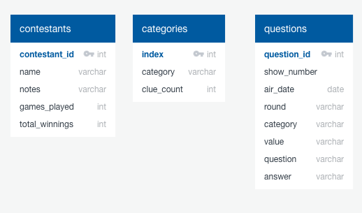
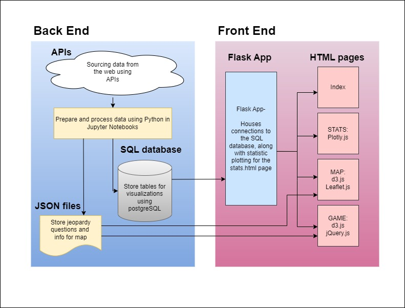
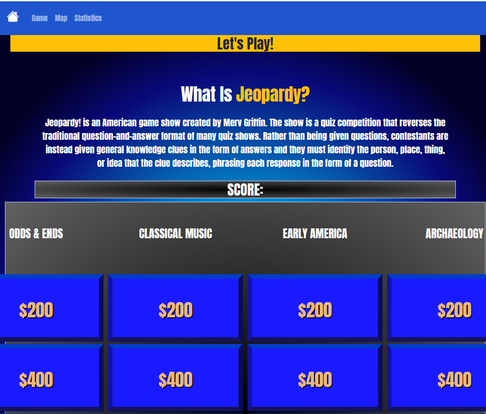
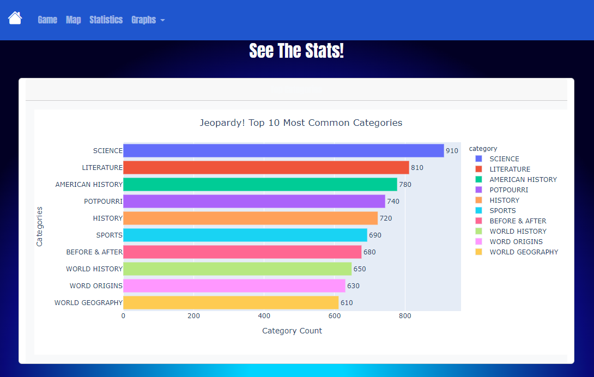
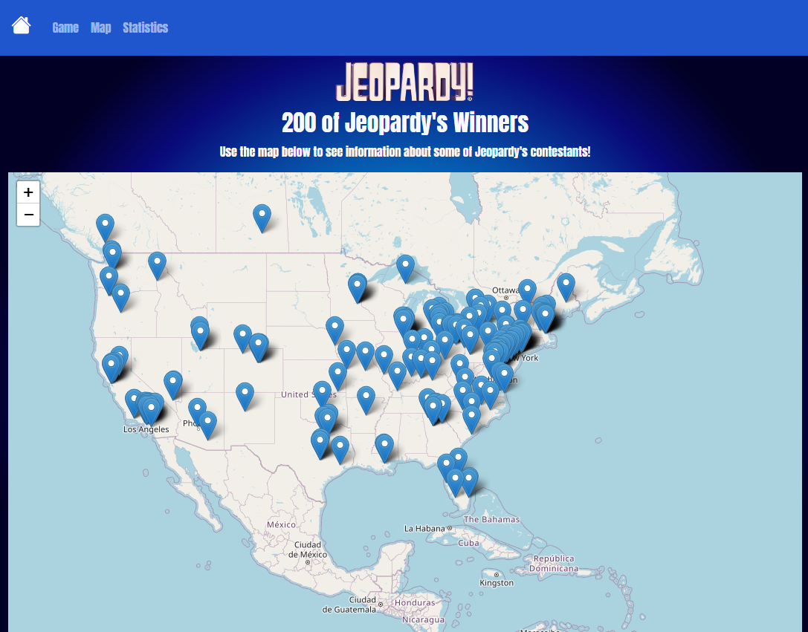
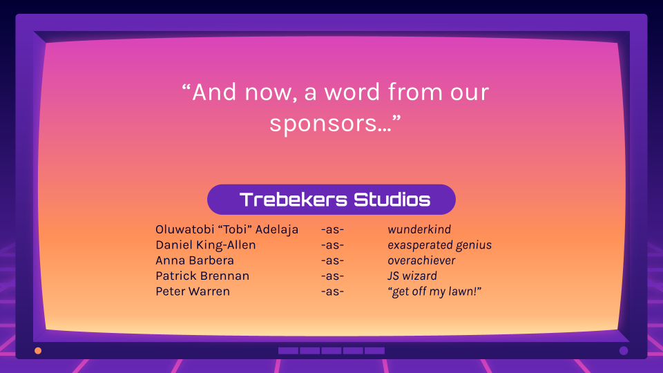

# Jeo-PARTY
<h3>Group project designed to allow the user to <b> play the popular trivia game show Jeopardy!</b> and also <b> see some fun facts</b> regarding the franchise.</h3>

# Project Overview:
To design an informative and interactive website powered by Python Flask API that includes use of HTML/CSS and JavaScript.  Resources include:
<b> 
[Cluebase](https://cluebase.readthedocs.io/en/latest/) 
[jService](http://jservice.io/) 
[J! Archive](https://j-archive.com/) 
[Plotly](https://plotly.com/javascript/) 
[Leaflet](https://leafletjs.com/) 
</b>

# Project Structure:
After narrowing down our theme of choice to focus on the popular game show "Jeopardy" using data from the show from 1984-2012, we first created a simplistic website wireframe to plan out how we wanted to visually organize our data.  We chose to make a multi-page site with a home page that could take users to either a playable game of Jeopardy, an interactive map to see where some of the top winners have come from, or a statistics page with interactive and informative charts regarding some Jeopardy show facts from over the years.

This project can be recreated on a local server and is also hosted [here](#).

# Project Contributors:
1. Oluwatobi Adelaja
2. Daniel King-Allen
3. Anna Barbera
4. Patrick Brennan
5. Peter Warren

# Data ETL
Pandas was used to load JSON from Cluebase into a dataframe. This dataframe was then cleaned before being read into a postgres database. The information in this database was used to create interactive data visualizations for the stats.  Upon recreation of this project, the user would need to personalize their own username and password information to access the postgreSQL database.  This can be done in the Flask app.py itself in the main repository.

<b>Database tables</b>

<b>Pandas was used to clean data from jService and create a JSON file that was used for the game portion of the project.</b>

# Website Organization
The website is organized into three sections.
 - Play The Game!
 - See The Stats!
 - View the Map!

## The Game
The Game was created using javascript (including libraries jQuery and d3.js) and contains a gameboard that mimics the look and feel of the actual Jeopardy! gameboard. 

Game categories and the answers for those categories are randomized every time the page is reloaded. When a player picks an answer, the response to the answer is entered into a text box. The response must exactly match what is contained in the JSON file. 

 - Correct answers will add to the player's total score.
 - The background of incorrect answers will turn red.
 - The background of correct answers will turn green.
 - The answer's element can be inspected to get the correct answer.

 

 ## The Stats
Accessing the SQL database from inside the flask app, charts were populated that assist the user in visualizing the top clue categories from the years 1985-2012.  Another visual created shows the shows highest earning players, along with how many games they played to reach that goal.  These charts were created using JavaScript and Plotly and are interactive.

 ## The Map
The interactive map shares a sample set of 200 winning contestants from Jeopardy from the years 1985-2012, along with information about how much they won, how many games they played, and a personal fact.  This US map is generated using Leaflet.js and was created in part by using Google Maps API.  Upon recreation of this project, the user would need to apply their own api key in order to generate coordinates data from the city/state location information available from the original data source. 

# Thank you!
